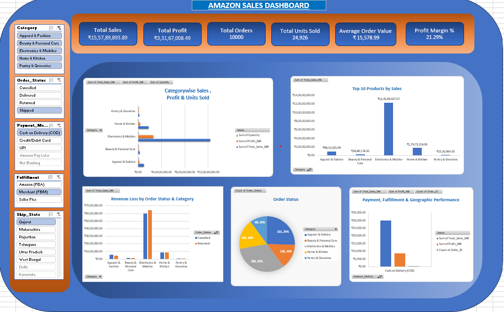

# 📊 Amazon India Management Dashboard (Excel Analytics Project)



## 📌 Executive Summary
This project delivers an interactive, executive-ready **Amazon India Management Dashboard** built in Microsoft Excel. Designed for non-technical stakeholders and business leadership, the dashboard consolidates **10,000 transaction records** into actionable insights across sales performance, profitability, product category dominance, operational fulfillment efficiency, and geographic distribution.

The analysis evaluates key business metrics totaling **₹15.57 Crore in Revenue** and **₹3.31 Crore in Net Profit**, while highlighting critical revenue loss areas from returns and cancellations.

---

## 🔑 Key Performance Indicators (KPI Overview)

* **Total Revenue:** ₹15,57,89,893.89 (₹15.57 Cr)
* **Total Profit:** ₹3,31,67,008.49 (₹3.31 Cr)
* **Overall Profit Margin:** 21.29%
* **Total Orders Processed:** 10,000 orders
* **Total Units Sold:** 24,926 units
* **Average Order Value (AOV):** ₹15,578.99
* **Revenue Loss (Returns + Cancellations):** ₹1,56,48,742.64 (10.04% of Gross Sales)

---

## 📐 Project Structure & Sections

### 1️⃣ Overall Sales & Profit Performance
* **Monthly Sales & Profit Trend:** Tracks performance trajectories across 2024–2026 to evaluate seasonal spikes and margin health over time.
* **Core KPI Header Cards:** Displays real-time executive summaries for Gross Revenue, Profit, Order Volumes, and Profit Margins.

### 2️⃣ Category & Product Performance
* **Category Breakdown:** Measures volume, revenue, and net profit generation across all 5 core categories (*Electronics & Mobiles, Home & Kitchen, Apparel & Fashion, Beauty & Personal Care, Pantry & Groceries*).
* **Top 10 Products by Sales:** Isolates top-performing individual items driving revenue.

### 3️⃣ Order Status & Revenue Loss Analysis
* **Fulfillment Efficiency:** Categorizes order statuses into **Delivered (8,147)**, **Shipped (868)**, **Returned (485)**, and **Cancelled (500)**.
* **Return & Cancellation Benchmarks:** Measures Return Rate (**4.85%**) and Cancellation Rate (**5.00%**).
* **Category-wise Revenue Loss:** Identifies specific product categories incurring high lost revenue due to cancellations and returns (dominated by *Electronics & Mobiles* at ~₹1.24 Cr lost revenue).

### 4️⃣ Payment, Fulfillment & Geographic Performance
* **Channel Performance:** Evaluates revenue and profit contributions across Payment Methods (*UPI, COD, Credit/Debit Cards, Net Banking, Amazon Pay Later*) and Fulfillment Models (*Amazon FBA, Merchant FBM, Seller Flex*).
* **Geographic Distribution:** Analyzes state-level market share across top Indian states (*Maharashtra, Delhi, Karnataka, Telangana, Tamil Nadu, Kerala, Gujarat, Rajasthan*).

---

## 💡 Strategic Business Insights

1. **Category Dominance:** Electronics & Mobiles serves as the primary revenue and profit driver, contributing over 70% of total revenue.
2. **Operational Loss Mitigation:** Combined returns and cancellations reduce overall revenue by **10.04%** (₹1.56 Cr). Implementing stricter seller quality checks on high-ticket electronics can significantly curb this loss.
3. **Payment Preference:** Digital transactions (UPI and Cards) account for the majority of sales volume and demonstrate lower cancellation rates compared to Cash on Delivery (COD).

---

## 🛠️ Excel Technical Features Used
* **Pivot Tables & Pivot Charts:** Dynamic aggregation of 10,000 raw datasets.
* **Helper Columns & Formulas:** Utilized `DATEVALUE()`, `TEXT()`, `YEAR()`, and `COUNTIF()` for date standardization and custom KPIs.
* **Interactive Slicers:** Multi-select cross-filtering by *Category, Order Status, Payment Method, Fulfillment Method,* and *Ship State*.
* **Data Formatting:** Strict currency (`₹`), percentage (`%`), and standard number formatting across all elements.

---

## 📁 Repository Structure

```
├── Amazon_India_Dashboard.xlsx     # Full Excel Workbook (Data, Pivot Tables, Dashboard)
├── README.md                        # Project documentation & overview
└── dashboard_preview.png            # High-resolution screenshot of the dashboard tab
```

---

## 🚀 How to View & Use the Project

1. **Clone or Download:** Download the `Amazon_India_Dashboard.xlsx` workbook directly from this repository.
2. **Open in Microsoft Excel:** Ensure macros/slicers are enabled (Excel 2016 or newer recommended).
3. **Interact with Slicers:** Navigate to the **`Dashboard`** tab and click on any Slicer on the left panel (e.g., filter by *State* or *Payment Method*) to watch all charts and KPI cards update dynamically.

---
*Created as part of the Sapphire IQ Analytics Management Program.*